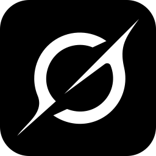
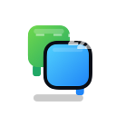

<h1 align="center">
  &nbsp;
  CodeIsland
</h1>
<p align="center">
  <b>Real-time AI coding agent status panel for macOS Dynamic Island (Notch)</b><br>
  <a href="#installation">Install</a> •
  <a href="#features">Features</a> •
  <a href="#supported-tools">Supported Tools</a> •
  <a href="#build-from-source">Build</a><br>
  English | <a href="README.zh-CN.md">简体中文</a>
</p>

---

<p align="center">
  
</p>

## What is CodeIsland?

CodeIsland lives in your MacBook's notch area and shows you what your AI coding agents are doing — in real time. No more switching windows to check if Claude is waiting for approval or if Codex finished its task.

It connects to **16 AI coding tools** via Unix socket IPC, displaying session status, tool calls, permission requests, and more — all in a compact, pixel-art styled panel.

## Features

- **Notch-native UI** — Expands from the MacBook notch, collapses when idle
- **16 AI tools supported** — Claude Code, Codex, Grok CLI, Gemini CLI, Cursor, Copilot, Trae/Traecli, Qoder, Factory, CodeBuddy, OpenCode, Kimi Code CLI, Cline, Pi / Oh My Pi, DeepSeek Harness, AiWork
- **Live status tracking** — See active sessions, tool calls, and AI responses in real time
- **Permission management** — Approve/deny tool permissions directly from the panel
- **Question answering** — Respond to agent questions without leaving your current app
- **Pixel-art mascots** — Each AI tool has its own animated character
- **One-click jump** — Click a session to jump to its terminal tab, IDE window, or exact Herdr agent pane
- **Smart suppress** — Tab-level terminal and Herdr pane detection: only suppresses notifications when you're looking at the specific session, not just the terminal app
- **Sound effects** — Optional 8-bit sound notifications for session events
- **Auto hook install** — Automatically configures hooks for all detected CLI tools, with auto-repair and version tracking
- **iPhone & Apple Watch Buddy** — Mirror session status to Dynamic Island, Lock Screen, StandBy, and Apple Watch
- **Bilingual UI** — English and Chinese, auto-detects system language
- **Multi-display** — Works with external monitors, auto-detects notch displays

## Supported Tools

| | Tool | Events | Jump | Status |
|:---:|------|--------|------|--------|
|  |  Claude Code | 13 | Terminal tab | Full |
|  |  Codex | 3 | Terminal | Basic |
| |  Grok CLI | 14 | Terminal | Basic |
|  |  Gemini CLI | 6 | Terminal | Full |
|  |  Cursor | 10 | IDE | Full |
|  |  TraeCli | 10 | Terminal | Full |
|  |  Qoder | 10 | IDE | Full |
| |  Copilot | 6 | Terminal | Full |
|  |  Factory | 10 | IDE | Full |
|  |  CodeBuddy | 10 | APP/Terminal | Full |
| |  Kimi Code CLI | 10 | Terminal | Full |
|  |  OpenCode | All | APP/Terminal | Full |
|  |  Cline | 5 | VSCode | Full |
| |  Pi / Oh My Pi | 8 | Terminal | Full |
| |  DeepSeek Harness | 9 | Terminal | Full |
| |  AiWork | 20 | IDE/Terminal | Full |

## Installation

### Homebrew (Recommended)

```bash
brew tap wxtsky/tap
brew install --cask codeisland
```

### Manual Download

1. Go to [Releases](https://github.com/wxtsky/CodeIsland/releases)
2. Download `CodeIsland.dmg`
3. Open the DMG and drag `CodeIsland.app` to your Applications folder
4. Launch CodeIsland — it will automatically install hooks for all detected AI tools

> **Note:** On first launch, macOS may show a security warning. Go to **System Settings → Privacy & Security** and click **Open Anyway**.

### iPhone & Apple Watch Buddy

Code Island Buddy is available on the App Store:

[Download Code Island Buddy](https://apps.apple.com/us/app/code-island-buddy/id6773881129)

The iPhone app mirrors your Mac sessions to Dynamic Island, Lock Screen, StandBy, and Apple Watch. The Mac app publishes lightweight session snapshots over your local network while the iPhone app is open, and sends compact Bluetooth summaries for background refreshes such as Live Activities and Watch updates.

Code Island Buddy is completely free and open source. It does not require an account or an external server; the companion source code lives in this repository under `ios/CodeIslandCompanion` and `apple-companion`.

**Getting started:** on the Mac, open **Settings → Buddy → iPhone Buddy** and turn on *Allow iPhone Buddy to discover this Mac*. Open the iPhone app on the same Wi-Fi to pair; connected devices are listed right below the toggle. macOS asks for Local Network and Bluetooth permission on first connect — grant both: Local Network carries the full snapshots while the app is in front, Bluetooth carries the summaries that refresh the Live Activity and the Watch once it is backgrounded. *Sync interval* in the same section controls how often those go out.

### Hardware Buddy (ESP32)

Beyond the phone, CodeIsland drives a small ESP32 screen on your desk over BLE, playing the pixel mascot animation for the current agent state — asleep when idle, typing while it works, calling you when it needs an approval or an answer.

Parts list, firmware flashing, and pairing steps are in **[hardware/README.md](hardware/README.md)** (written in Chinese, including the exact dev board and where to buy it). The Mac-side switch is in the hardware Buddy section of **Settings → Buddy**.

### Build from Source

Requires **macOS 14+** and **Swift 5.9+**.

```bash
git clone https://github.com/wxtsky/CodeIsland.git
cd CodeIsland

# Development (debug build + launch; Buddy Bluetooth needs the .app below)
swift build && ./.build/debug/CodeIsland

# Release (universal binary: Apple Silicon + Intel)
./build.sh
open .build/release/CodeIsland.app
```

## How It Works

```
AI Tool (Claude/Codex/Gemini/Cursor/...)
  → Hook event triggered
    → codeisland-bridge (native Swift binary, ~86KB)
      → Unix socket → /tmp/codeisland-<uid>.sock
        → CodeIsland app receives event
          → Updates UI in real time
          → Optional local Buddy sync to iPhone / Apple Watch
```

CodeIsland installs lightweight hooks into each AI tool's config. When the tool triggers an event (session start, tool call, permission request, etc.), the hook sends a JSON message through a Unix socket. CodeIsland listens on this socket and updates the notch panel instantly.

For **OpenCode**, a JS plugin connects directly to the socket — no bridge binary needed.

For **Codex**, one extra step is yours and not something CodeIsland can do for you: Codex will not run a hook it has not been shown. After installing, start Codex and it reports `1 hook needs review before it can run.` — run `/hooks`, review the CodeIsland entries and trust them. Until then Codex simply does nothing with them, with no error, which looks exactly like CodeIsland not supporting Codex. Codex records a content hash per trusted hook in `~/.codex/config.toml` under `[hooks.state]`, so if a CodeIsland update rewrites `~/.codex/hooks.json`, the review is needed once more.

For **DeepSeek Harness (DSH)**, the [dsh-island](https://github.com/cdxiaodong/dsh-island) cordis plugin listens to DSH's built-in events (`session/created`, `tools/pre-execute`, `approval/request`, …) and writes the same JSON over the Unix socket. Install it inside DSH:

```bash
dsh plugin --profile <profile> add github:cdxiaodong/dsh-island
```

DSH is plugin-native, so no hook configuration is installed — CodeIsland only needs to know the `dsh` source name to render its session card.

## Settings

CodeIsland provides a 7-tab settings panel:

- **General** — Language, launch at login, display selection
- **Behavior** — Auto-hide, smart suppress, session cleanup
- **Appearance** — Panel height, font size, AI reply lines
- **Mascots** — Preview all pixel-art characters and their animations
- **Sound** — 8-bit sound effects for session events
- **Hooks** — View CLI installation status, reinstall or uninstall hooks
- **About** — Version info and links

## Keyboard Shortcuts

| Shortcut | Action | Default |
|----------|--------|---------|
| ⌘⇧I | Toggle the island panel open/closed | On |
| ⌘⇧A | Approve the current permission request | Off |
| ⌘⇧D | Deny the current permission request | Off |

All shortcuts are configurable — and more actions (always-allow, skip question, jump to terminal) can be bound — under **Settings → Shortcuts**. When an approve/deny shortcut is enabled, its binding shows as a badge right on the approval card.

## Requirements

- macOS 14.0 (Sonoma) or later
- Works best on MacBooks with a notch, but also works on external displays

## Acknowledgments

This project was inspired by [claude-island](https://github.com/farouqaldori/claude-island) by [@farouqaldori](https://github.com/farouqaldori). Thanks for the original idea of bringing AI agent status into the macOS notch.

## Star History

<a href="https://star-history.dera.page/#wxtsky/CodeIsland&type=date&legend=bottom-right">
   <picture>
     <source media="(prefers-color-scheme: dark)" srcset="https://star-history.dera.page/svg?repos=wxtsky/CodeIsland&type=date&theme=dark&legend=top-left" />
     <source media="(prefers-color-scheme: light)" srcset="https://star-history.dera.page/svg?repos=wxtsky/CodeIsland&type=date&legend=top-left" />
     
   </picture>
</a>

## License

MIT License — see [LICENSE](LICENSE) for details.
